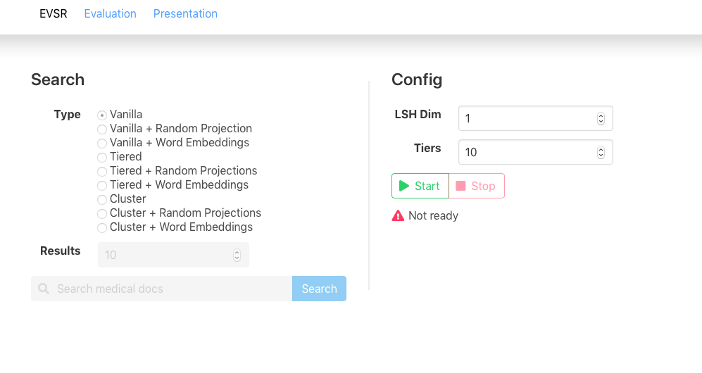

#Server
Because we build a _"search-engine-like"_ project, we decied to implement a small web server which provides users with a simple interface to issue free text queries against the document collection. This is realized with an `express.js` server and a `React` built front-end. With the help of the interface the user is able to start the project with different configurations as well as use different index strucures to query the collection. This gives a more natural feeling of using the system than over the command line.



To use the UI to interact with the binary, you need to have `Node.js` and `npm` installed on your machine.
Issue the following command to install all needed dependencies and build all staticly served files (__Note__ all paths are relative to the top level repository directory):

## Install:

```
$ ./install_server.sh
```

Visit [localhost:8080](localhost:8080)


## Develop Versions

The server uses the build version of the React application. If you want to not use the build React application, issue the following commands in two separate terminal sessions.

__1st Terminal__

```
$ cd ./evsr-web/client
$ npm run start
```

_2nd Terminal__

```
$ cd ./evsr-web/server
$ npm run start
```

Visit [localhost:3000](localhost:3000). This is now the development server of the React applications which interacts with the backend of the server on localhost:8080
